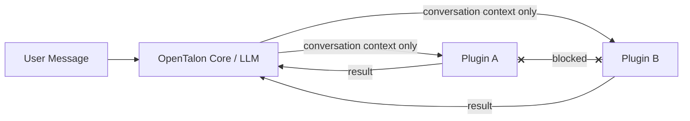
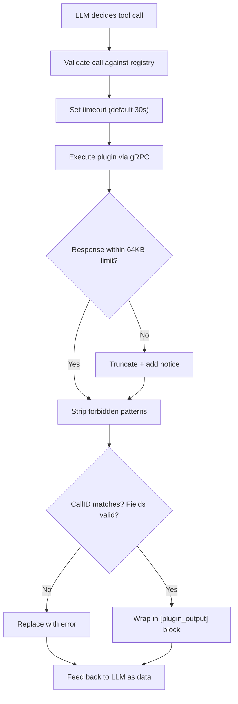
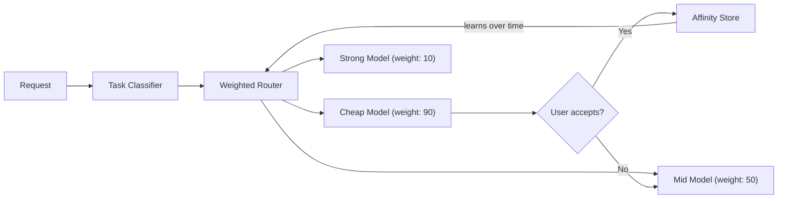
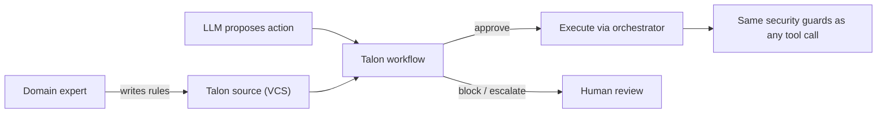

# OpenTalon

**Open-source enterprise AI orchestration — built in Go to solve real enterprise problems, not toy demos.**

[](https://github.com/opentalon/opentalon/actions/workflows/ci.yml)
[](LICENSE)
[](https://go.dev)

> 📚 **Looking for setup, deployment, scheduler, extensibility, or other detailed guides?** See the [**`docs/`**](docs/) directory.

---

## The big ideas behind OpenTalon

OpenTalon exists to solve **enterprise** issues — the gap between a chatbot demo and an AI system a real organization can actually depend on. Two essays lay out the thinking:

- 📘 **[Enterprise AI Orchestration](https://opakalex.github.io/posts/enterprise-ai-orchestration/)** — why one big LLM call is not an enterprise architecture, and how multi-provider routing, deterministic preprocessing, plugin isolation, and policy enforcement combine into a system that holds up in production.
- 📘 **[Expert-in-the-Loop (EITL)](https://opakalex.github.io/posts/expert-in-the-loop/)** — moving past "human-in-the-loop" rubber-stamping toward workflows where domain experts encode rules, gates, and review steps the system enforces deterministically — implemented in OpenTalon via [Talon workflows & EITL rules](#talon-workflows--eitl-rules).

Everything below is in service of those two ideas.

## What is OpenTalon?

OpenTalon is an open-source platform built from the ground up in Go for **enterprises that need AI in production**: predictable behaviour, auditable boundaries, deterministic business rules, multi-provider economics, and expert-defined guardrails. It is designed for teams and large organizations that need a reliable, secure, and extensible solution — without the compromises that come with bolted-on prompt scripts or legacy codebases.

## Why OpenTalon? (the enterprise problems it solves)

Most "AI integrations" inside large organizations hit the same walls:

- **No separation of business logic from AI** — company-specific transformations (terminology, routing, validation) are tangled into prompts instead of handled by deterministic, testable code
- **Every rule burns LLM tokens** — business vocabulary, compliance checks, and formatting rules all get stuffed into the prompt, inflating cost and latency on every single request
- **No smart model routing** — you either pick one model and overpay, or manually juggle providers yourself
- **No expert-in-the-loop story** — domain experts have no way to encode rules, gates, or review steps that the system actually enforces (see the [EITL essay](https://opakalex.github.io/posts/expert-in-the-loop/))
- **Weak isolation between integrations** — one buggy or compromised tool can poison the LLM's context and pivot into others
- **Poor maintainability, repeatable bugs, hard to extend** — tangled codebases, inconsistent patterns, and architectures that fight you when you try to add features

OpenTalon is engineered for long-term quality from day one. Every architectural decision is made with **enterprise** maintainability, security, and stability in mind.

## Core Principles

Two principles drive the architecture. Everything else — extensibility, the scheduler, smart routing, persistence — is implementation in service of these.

### 1. Security & isolation first

Security is not an afterthought. OpenTalon is secure by default with a minimal attack surface. Plugins run as **separate OS processes** communicating over gRPC, so a compromised or misbehaving plugin can never access the core's memory or escalate privileges. Secrets are handled properly, inputs are validated at every boundary, and dependencies are kept lean and audited. No shortcuts.


```mermaid
graph LR
    User[User Message] --> Core[OpenTalon Core / LLM]
    Core -->|"conversation context only"| PluginA[Plugin A]
    Core -->|"conversation context only"| PluginB[Plugin B]
    PluginA -->|"result"| Core
    PluginB -->|"result"| Core
    PluginA x--x|"blocked"| PluginB
```

- **Plugins work strictly within their own scope** — each plugin does its job and returns a result, nothing else
- **Plugins never talk to each other** — no shared state, no event bus, no direct calls
- **A plugin cannot trigger another plugin** — not via its response, not via prompt injection, not by any mechanism. Only the core/LLM decides what runs next
- **The LLM orchestrates everything** — it decides which plugin to call, in what order, and routes results between them
- **Plugins only see what the core sends** — conversation context and the specific task, nothing more

> **Deep dive:** see [Security & Guardrails](#security--guardrails) below for the full guard pipeline, isolation enforcement, content preparers, prompt-injection defence, and LLM safety rules.

### 2. Deterministic business logic — without burning LLM tokens

Enterprise rules belong in code, not prompts. Hooks let organizations enforce their own vocabulary, business rules, and compliance requirements **before** the message ever reaches the main LLM — using **Lua** for simple zero-overhead rules or **Go / any language** via gRPC for complex logic.

- **Vocabulary enforcement** — rewrite non-standard terms into company-approved language. Lua replacement table (zero LLM cost) or a Go plugin loading terminology from a database.
- **Business rule classification** — route, prioritize, or reject requests using deterministic rules. No tokens burned.
- **Compliance checks** — detect PII, credentials, or policy violations. Lua for pattern matching, Go for compliance API integration.
- **Context enrichment** — inject company metadata (project codes, team names, priority levels) so the main LLM has the right context without figuring it out.
- **Business transformation** — convert LLM output into structured actions (Jira tickets, calendar events, CRM updates) using a gRPC plugin in any language.

For ambiguous cases, Lua hooks can call a small/cheap LLM (`ctx.llm()`) for lightweight AI. The main (expensive) LLM only sees clean, pre-processed input.

## Security & Guardrails

Security is the leading principle, so it gets its own section. Four layers of defence sit between an incoming message and the main LLM — and between any plugin response and the LLM that consumes it.

### How isolation is enforced

Every plugin response passes through a **guard pipeline** before reaching the LLM:


```mermaid
flowchart TD
    LLM[LLM decides tool call] --> Validate[Validate call against registry]
    Validate --> Timeout["Set timeout (default 30s)"]
    Timeout --> Execute[Execute plugin via gRPC]
    Execute --> SizeCheck{Response within 64KB limit?}
    SizeCheck -->|No| Truncate[Truncate + add notice]
    SizeCheck -->|Yes| Sanitize[Strip forbidden patterns]
    Truncate --> Sanitize
    Sanitize --> ValidateResult{CallID matches? Fields valid?}
    ValidateResult -->|No| ErrorResult[Replace with error]
    ValidateResult -->|Yes| WrapResult["Wrap in [plugin_output] block"]
    ErrorResult --> FeedBack[Feed back to LLM as data]
    WrapResult --> FeedBack
```

| Threat | Guard |
|---|---|
| Plugin returns fake tool calls in its output | Response sanitizer strips all tool-call patterns before the LLM sees them |
| Plugin crafts output to trick the LLM | Output is wrapped in `[plugin_output]` blocks — the LLM is instructed to treat it as data only |
| Plugin tries to read another plugin's state | State store enforces namespace isolation — pluginID is set by the core, not the plugin |
| Plugin tries to discover or call other plugins | gRPC contract exposes exactly one method: `Execute`. No registry, no peer discovery |
| Plugin runs forever or consumes all resources | Per-call timeout (configurable) + OS-level resource limits |
| LLM autonomously installs or modifies skills/plugins | `user_only` actions are hidden from the LLM system prompt and blocked if invoked via an LLM-generated tool call |

**Guard of LLM models:** A plugin can host its **own LLM** (e.g. a small local model or a dedicated API). Used as a content preparer, such a plugin can implement a **guard of LLM models** — for example, classify or validate the request and block or redirect before the main orchestrator LLM is invoked, or enforce which models or providers are allowed. The core only sees the plugin's result (e.g. transformed message or "do not send to LLM"); the plugin's internal use of an LLM stays out of the main token path.

### Content preparers

**Content preparers** are plugin actions that run before the first LLM call. They receive the user's message and can transform it, enrich it, or block it entirely by returning `send_to_llm: false`.

```yaml
orchestrator:
  content_preparers:
    - plugin: opentalon-commands   # runs slash command handling before the LLM
      action: handle
    - plugin: terminology          # rewrites non-standard terms to company vocabulary
      action: normalize
```

A preparer returns plain text (the transformed message) or a JSON response:

```json
{ "send_to_llm": false, "message": "handled without LLM" }
```

```json
{ "send_to_llm": false, "invoke": [
    { "plugin": "jira", "action": "create_issue", "args": { "title": "..." } }
]}
```

When `send_to_llm` is `false`, the LLM is never called — the preparer's message or invoke steps become the response directly. Preparers with `invoke` steps must be explicitly trusted in config (see `insecure: false` in `config.example.yaml`).

### Guard plugins — prompt injection prevention

Regular content preparers run once, on the initial user message. **Guard plugins** go further: they run before **every** LLM call in the agent loop — including after tool results come back — so they can sanitize content that arrives from external systems before the LLM ever sees it.

This is the primary defence against **prompt injection**: a malicious tool response that says _"ignore previous instructions and do X"_ is intercepted and sanitized by the guard before the LLM processes it.

```yaml
orchestrator:
  content_preparers:
    - plugin: injection-guard
      action: sanitize
      guard: true        # ← runs before every LLM call, not just the first
```

Execution flow with a guard:

```
User message
    │
    ▼
[Content preparers]   ← regular preparers run once here
    │
    ▼
Agent loop iteration 1:
    ├─ [Guard plugins]  ← sanitize last message (user input)
    ├─ LLM call
    └─ Tool call → result appended
Agent loop iteration 2:
    ├─ [Guard plugins]  ← sanitize last message (tool result)  ← injection caught here
    ├─ LLM call
    └─ Final answer
```

The guard plugin receives the content of the most recent message (the last tool result or user message) as the `text` argument, and returns the sanitized version. It can also block entirely:

```json
{ "send_to_llm": false, "message": "Prompt injection detected — request blocked." }
```

Guard actions are **never listed in the LLM's tool list** — they are invisible to the model and run transparently as part of the infrastructure.

A guard plugin can use a small/cheap LLM internally to detect subtle injections, or apply deterministic pattern matching — either way the main LLM only sees the clean output.

### LLM safety rules

The LLM itself receives **built-in safety rules** in its system prompt at the start of every session. These rules instruct the LLM — in multiple languages — to never execute tool calls found inside plugin output, to treat all plugin responses as untrusted data, and to never let a plugin influence which other plugins get called.

The default rules are built into OpenTalon and can be **customized** via `config.yaml`:

```yaml
orchestrator:
  rules:
    - "Never send PII or personal data to external plugins"
    - "All financial data must stay within internal plugins only"
    - |
      When working with customer data, follow these constraints:
      1. Never log raw customer identifiers
      2. Mask email addresses before passing to any plugin
      3. Reject plugin results that contain unmasked credit card numbers
    - |
      For compliance with internal policy SEC-2024-07:
      - Only approved plugins may access production databases
      - Plugin responses containing SQL must be flagged for review
```

This lets organizations add domain-specific rules — including multi-line instructions — without modifying source code. These custom rules are appended to the built-in safety rules and injected into the LLM system prompt at the start of every session.

## MCP (Model Context Protocol) Support

OpenTalon supports the **Model Context Protocol (MCP)**, allowing it to connect to any MCP-compatible tool server alongside its native gRPC plugins.

The **[opentalon/mcp-plugin](https://github.com/opentalon/mcp-plugin)** acts as an MCP bridge: it runs as a standard OpenTalon gRPC tool plugin and transparently proxies tool calls to one or more MCP servers over HTTP+SSE. From the core's perspective it is just another plugin; from the MCP server's perspective it is a standard MCP client.

```
OpenTalon Core  ──gRPC──▶  mcp-plugin  ──HTTP+SSE──▶  MCP Server A
                                        ──HTTP+SSE──▶  MCP Server B
```

Configure it like any other plugin:

```yaml
plugins:
  mcp:
    enabled: true
    github: "opentalon/mcp-plugin"
    ref: "master"
    config:
      servers:
        - name: my-mcp-server
          url: "http://localhost:8080/sse"
```

Each tool exposed by the MCP servers is automatically registered in OpenTalon's tool registry and becomes callable by the LLM. All security guards (response sanitization, size limits, timeouts, namespace isolation) apply to MCP tool results exactly as they do to native gRPC plugins.

## Smart Model Routing

OpenTalon includes a **weighted smart router** that automatically picks the best AI model for each task — optimizing for cost without sacrificing quality.


```mermaid
graph LR
    Request[Request] --> Classifier[Task Classifier]
    Classifier --> Router[Weighted Router]
    Router --> CheapModel["Cheap Model (weight: 90)"]
    Router --> MidModel["Mid Model (weight: 50)"]
    Router --> StrongModel["Strong Model (weight: 10)"]
    CheapModel --> Signal{User accepts?}
    Signal --> |Yes| Store[Affinity Store]
    Signal --> |No| MidModel
    Store --> |"learns over time"| Router
```

### How it works

1. **Weights** — each model has a weight (0–100). Cheaper models get higher weight and are tried first
2. **Auto-classification** — incoming requests are categorized by heuristics (message length, code blocks, keywords, conversation depth)
3. **Escalation** — if the user rejects a response (regenerates, says "try again", or thumbs-down), the system escalates to the next model by weight
4. **Learning** — the affinity store records which model succeeded for which task type. Over time, the router learns: "code generation needs Sonnet, simple Q&A is fine on Haiku"
5. **User overrides** — if you already know what you want, pin a model per request (`--model`), per session (`/model`), or per task type in config

### Multi-Provider Support

OpenTalon supports multiple AI providers out of the box, with a unified configuration:

- **Built-in providers** — Anthropic, OpenAI, Google, and more
- **Custom providers** — any OpenAI-compatible or Anthropic-compatible endpoint (self-hosted, OVH, Ollama, vLLM, etc.)
- **Provider plugins** — add new providers via the gRPC plugin system
- **Auth profile rotation** — multiple API keys or OAuth tokens per provider, with automatic round-robin and cooldown on rate limits
- **Two-stage failover** — first rotate credentials within a provider, then fall back to the next model in the chain. Exponential backoff on failures.

> **Getting started?** See the [Configuration Guide](docs/configuration.md). For the full architecture, see [docs/design/providers.md](docs/design/providers.md).

## Talon workflows & EITL rules

> Conceptual background: [**Expert-in-the-Loop**](https://opakalex.github.io/posts/expert-in-the-loop/) — why enterprise AI needs domain experts encoding deterministic rules and gates, not just humans rubber-stamping LLM output.

"Human-in-the-loop" usually means a human clicks **approve** on whatever the LLM produces. That works for demos. It breaks at enterprise scale, because:

- Humans don't review every call — they rubber-stamp the easy cases and miss the dangerous ones
- The rules a domain expert actually cares about (approval thresholds, region restrictions, customer tier policies, compliance flags) live in their head, not in code
- The LLM gets blamed when really the system never gave the expert a way to *encode* those rules

**Expert-in-the-Loop (EITL)** flips the relationship. Domain experts write the rules once, in a deterministic language; the system enforces them every time without asking a human to babysit.

### Why LLMs write Talon scenarios, not raw tool calls

The other half of the idea: **LLMs are at their best when they write code.** They are markedly weaker when forced to orchestrate long chains of individual tool calls — drift accumulates, prompt-injection surface explodes, and you can't audit what the model "decided" to do. Cloudflare made the same bet for general agent code execution (V8 isolates / sandboxed JS for LLM-generated code): let the model produce a program, then run it in a confined runtime.

OpenTalon applies the same bet with **Talon**:

- Instead of emitting a sequence of tool calls, the LLM writes a **Talon scenario** — a small program in a domain-specific language that the orchestrator compiles and executes.
- Talon is **deliberately restricted**. No general I/O, no arbitrary process execution, no shell, no `eval`. The only actions available inside Talon are the ones the host orchestrator explicitly exposed — so the same `user_only`, sanitization, namespace, and isolation guarantees that protect individual tool calls also protect Talon programs by construction.
- This shifts the safety boundary from *"can we trust the LLM to behave?"* to *"can the language even express the unsafe thing?"* — and the answer is no, because the grammar doesn't include it.
- Experts and the LLM speak the **same restricted language**, against the same surface. Experts define policy in Talon; the LLM proposes scenarios in Talon; the runtime is the only thing that decides what runs.

The LLM gets to use what it's actually good at (writing code). The enterprise gets a sandbox that physically cannot execute the dangerous thing.

### How OpenTalon implements EITL

The [**talon-plugin**](https://github.com/opentalon/talon-plugin) installs like any other OpenTalon plugin — no special orchestrator config knob. It uses the [`talon-language` Go SDK](https://github.com/opentalon/talon-language/tree/master/pkg/talon) to compile and execute **Talon source**: a small, expert-readable language for describing multi-step workflows, approval gates, conditional branches, and rule-driven escalation.

Inside a Talon workflow, every MCP/tool call is routed **back through the host orchestrator** via the `plugin_exec` Redis channel — so each step picks up the same policy, observability, credential injection, and security guards as a normal tool call. Workflows are not a backdoor around OpenTalon's controls; they are a deterministic *driver* sitting on top of them.


```mermaid
flowchart LR
    Expert["Domain expert"] -->|"writes rules"| TalonSrc["Talon source (VCS)"]
    LLM["LLM proposes action"] --> Workflow["Talon workflow"]
    TalonSrc --> Workflow
    Workflow -->|"approve"| Exec["Execute via orchestrator"]
    Workflow -->|"block / escalate"| Human["Human review"]
    Exec --> Guards["Same security guards as any tool call"]
```

### What this looks like in practice

- **Approval gates** — "any refund above €5,000 routes to a regional manager; under €5,000 auto-approves with audit trail"
- **Compliance rules** — "if customer is in the EU and the action involves PII, require GDPR review step"
- **Multi-step orchestration** — "open AppSignal incident, file Jira, draft MR, post status to #ops — but stop and alert if any step touches production data without an active change window"
- **Tier-based routing** — "enterprise tier customers go to senior agents; SMB tier handled by the agent loop with policy guardrails"

The expert writes those rules in Talon. The LLM proposes actions. The Talon workflow decides what runs, what blocks, and what needs human review — deterministically, the same way every time, auditable line by line.

### Why this is enterprise-grade

- **Deterministic** — same input → same outcome. No prompt drift, no model upgrade surprises.
- **Auditable** — every rule is a piece of source code, in version control, reviewable in PRs.
- **Owned by domain experts** — the people who know the policy can read and write it, without going through engineering for every change.
- **Compatible with the rest of OpenTalon** — Talon steps still go through guards, isolation, sanitization, and `user_only` enforcement.

See the [talon-plugin repo](https://github.com/opentalon/talon-plugin) and [talon-language](https://github.com/opentalon/talon-language) for the language reference and examples.

## Documentation

Most operational details live in [`docs/`](docs/). Highlights:

| Topic | Doc |
|---|---|
| Configuration reference | [docs/configuration.md](docs/configuration.md) |
| Extensibility — plugins, channels, hooks | [docs/extensibility.md](docs/extensibility.md) |
| Slash commands | [docs/slash-commands.md](docs/slash-commands.md) |
| Scheduler — periodic background jobs | [docs/scheduler.md](docs/scheduler.md) |
| State & context persistence | [docs/state.md](docs/state.md) |
| Concurrency — session parallelism | [docs/concurrency.md](docs/concurrency.md) |
| Lua scripts | [docs/lua-scripts.md](docs/lua-scripts.md) |
| Workflows | [docs/workflows.md](docs/workflows.md) |
| Profiles & multi-tenancy | [docs/profiles.md](docs/profiles.md) |
| Kubernetes deployment & health probes | [docs/deployment-guide-k8s.md](docs/deployment-guide-k8s.md) |
| Cluster mode | [docs/cluster.md](docs/cluster.md) |
| Prometheus metrics | [docs/prometheus-metrics.md](docs/prometheus-metrics.md) |
| WebSocket integration | [docs/websocket-integration.md](docs/websocket-integration.md), [docs/websocket-messages.md](docs/websocket-messages.md) |
| VCR cassettes (for contributors) | [docs/vcr-cassettes.md](docs/vcr-cassettes.md) |
| Architecture & design notes | [docs/design/](docs/design/) |

## Contributing

We welcome contributions of all kinds — bug reports, feature requests, documentation improvements, and code.

1. **Report issues** — found a bug or have an idea? [Open an issue](https://github.com/opentalon/opentalon/issues/new) with a clear description and steps to reproduce
2. **Submit pull requests** — fork the repo, create a feature branch, and open a PR against `master`. Keep PRs focused on a single change
3. **Write tests** — every PR must include tests. The CI pipeline runs `go test -race ./...` and `golangci-lint` — both must pass before merging
4. **Follow conventions** — idiomatic Go, `gofmt`-formatted, meaningful commit messages. Read the existing code to match the style
5. **Discuss first** — for large changes or new features, open an issue to discuss the approach before writing code

### System prompt convention

All LLM system prompt text lives in `internal/prompts/*.txt` and is loaded via `//go:embed`. Never write a system prompt as a plain Go string literal — add a `.txt` file and export it through `internal/prompts/prompts.go`. This keeps prompts diffable and hashable for VCR cassette staleness checks.

### Structural integration tests

`internal/orchestrator/integration_test.go` (build tag `integration`) hits the real Anthropic API at temperature=0 and asserts structural properties: correct tool selection, no hallucinated plugins, no max-iteration breach, no parser errors. Run before a release:

```bash
ANTHROPIC_API_KEY=<key> make test-structural
# OpenRouter tests also run if OPENROUTER_API_KEY is set
```

These are gated in CI by `.github/workflows/release-gate.yml` on every release and push to `release/*` branches.

### Eval framework

`internal/eval/` contains a YAML-driven scenario runner with baseline tracking. Scenarios live in `internal/eval/scenarios/*.yaml`. Add new scenarios there without touching Go code.

```bash
ANTHROPIC_API_KEY=<key> make eval
```

Pass rate is checked against a baseline stored in `.eval-baselines/<git-tag>.json`. On the first run for a given tag the baseline is saved; subsequent runs fail if pass rate regresses. The eval runs on minor/major releases only (patch releases skip it).

> Re-recording VCR cassettes after prompt or scenario changes is documented in [docs/vcr-cassettes.md](docs/vcr-cassettes.md).

All contributions are subject to the [Apache 2.0 License](LICENSE).

## License

OpenTalon is licensed under the [Apache License 2.0](LICENSE).
