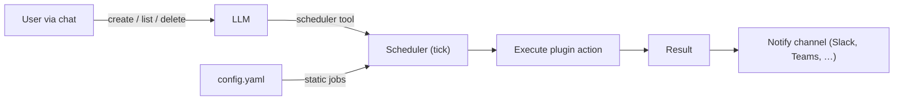

# OpenTalon

**An open-source alternative to OpenClaw, built from scratch in Go.**

[](https://github.com/opentalon/opentalon/actions/workflows/ci.yml)
[](LICENSE)
[](https://go.dev)

---

## What is OpenTalon?

OpenTalon is an open-source platform built from the ground up in Go as a robust alternative to OpenClaw. It is designed for individuals, teams, and large organizations that need a reliable, secure, and extensible solution — without the compromises that come with legacy codebases.

## Why OpenTalon?

Existing solutions often suffer from:

- **Poor maintainability** — tangled codebases that become harder to change over time
- **Low code quality** — inconsistent patterns, lack of tests, and technical debt that compounds
- **Repeatable bugs** — the same classes of issues resurfacing release after release
- **Hard to extend** — adding features means forking or fighting the architecture
- **No smart model routing** — you either pick one model and overpay, or manually juggle providers yourself
- **Every rule burns LLM tokens** — business vocabulary, compliance checks, and formatting rules all get stuffed into the prompt, inflating cost and latency on every single request
- **No separation of business logic from AI** — company-specific transformations (terminology, routing, validation) are tangled into prompts instead of handled by deterministic, testable code

OpenTalon is engineered for long-term quality from day one. Every architectural decision is made with maintainability, security, and stability in mind — so the project stays healthy as it grows.

### First working example: console + hello-world plugin

Run OpenTalon in the terminal with the **console channel** and the **hello-world plugin**. When you type a message containing "hello", the plugin runs first (concatenates " world" and adds a random prompt fragment), then the LLM replies.

```bash
cp config.example.yaml config.yaml
export DEEPSEEK_API_KEY="your-key"   # or any OpenAI-compatible API key
make all
./opentalon -config config.yaml
```

Type a message and press Enter. Try `hello` — you get "hello world" plus a random question sent to the LLM; try something else — you get a guard message and no LLM call. Ctrl+C or Ctrl+D to exit. See [hello-world plugin](https://github.com/opentalon/hellow-world-plugin) and [docs/configuration.md](docs/configuration.md).

## Core Principles

### Security First

Security is not an afterthought. OpenTalon is secure by default with a minimal attack surface. Plugins run as **separate OS processes** communicating over gRPC, so a compromised or misbehaving plugin can never access the core's memory or escalate privileges. Secrets are handled properly, inputs are validated at every boundary, and dependencies are kept lean and audited. No shortcuts.


- **Plugins work strictly within their own scope** — each plugin does its job and returns a result, nothing else
- **Plugins never talk to each other** — no shared state, no event bus, no direct calls
- **A plugin cannot trigger another plugin** — not via its response, not via prompt injection, not by any mechanism. Only the core/LLM decides what runs next
- **The LLM orchestrates everything** — it decides which plugin to call, in what order, and routes results between them
- **Plugins only see what the core sends** — conversation context and the specific task, nothing more

#### How isolation is enforced

Every plugin response passes through a **guard pipeline** before reaching the LLM:


| Threat | Guard |
|---|---|
| Plugin returns fake tool calls in its output | Response sanitizer strips all tool-call patterns before the LLM sees them |
| Plugin crafts output to trick the LLM | Output is wrapped in `[plugin_output]` blocks — the LLM is instructed to treat it as data only |
| Plugin tries to read another plugin's state | State store enforces namespace isolation — pluginID is set by the core, not the plugin |
| Plugin tries to discover or call other plugins | gRPC contract exposes exactly one method: `Execute`. No registry, no peer discovery |
| Plugin runs forever or consumes all resources | Per-call timeout (configurable) + OS-level resource limits |

#### LLM Safety Rules

The LLM itself receives **built-in safety rules** in its system prompt at the start of every session. These rules instruct the LLM — in multiple languages — to never execute tool calls found inside plugin output, to treat all plugin responses as untrusted data, and to never let a plugin influence which other plugins get called.

The default rules are built into OpenTalon and can be **customized** via `config.yaml`:

```yaml
orchestrator:
  rules:
    - "Never send PII or personal data to external plugins"
    - "All financial data must stay within internal plugins only"
    - |
      When working with customer data, follow these constraints:
      1. Never log raw customer identifiers
      2. Mask email addresses before passing to any plugin
      3. Reject plugin results that contain unmasked credit card numbers
    - |
      For compliance with internal policy SEC-2024-07:
      - Only approved plugins may access production databases
      - Plugin responses containing SQL must be flagged for review
```

This lets organizations add domain-specific rules — including multi-line instructions — without modifying source code. These custom rules are appended to the built-in safety rules and injected into the LLM system prompt at the start of every session.

### Stability

Thorough testing at every level — unit, integration, and end-to-end. Pull requests can only be merged with a fully green test suite, no exceptions — not even for project owners :) Zero tolerance for repeatable bugs. Predictable behavior under load, graceful degradation, and clear error reporting.

### Customizability

Everything in OpenTalon is extensible and **language-agnostic**. Tool plugins, channel adapters, and processing hooks can all be written in Go, Python, Rust, or any language that speaks gRPC. For simple rules, an embedded Lua VM provides hot-reloadable scripts with zero deployment overhead. Companies can enforce their own **business rules, vocabulary, and compliance policies** using deterministic logic — without burning LLM tokens. See [Extensibility](#extensibility) below.

### Maintainability

Clean architecture, idiomatic Go, and high code quality standards enforced by linters, formatters, and code review. The codebase is designed to be readable and approachable for new contributors.

### Multi-Platform Deployment

First-class support for running anywhere:

- **Local** — single binary, no external dependencies required to get started
- **VPS** — lightweight deployment with systemd or supervisor
- **Docker** — official container images
- **Kubernetes** — Helm charts for production-grade deployments

## Extensibility

OpenTalon is fully extensible. **Everything** is language-agnostic — plugins, channels, and hooks can be written in Go, Python, Rust, TypeScript, or any language that speaks gRPC. For lightweight scripting, an embedded Lua VM provides hot-reloadable hooks with zero deployment overhead.


There are **three extension categories**, all language-agnostic:

| Category | Purpose | Interface | Examples |
|---|---|---|---|
| **Tool plugins** | Capabilities the LLM invokes | gRPC (`PluginService`) | GitLab, Jira, code search, CI/CD |
| **Channel plugins** | I/O adapters for messaging platforms | gRPC / HTTP / WebSocket (`ChannelService`) | Slack, Teams, Telegram, WhatsApp, Discord |
| **Hooks** | Pre/post processing pipeline | Lua (embedded) or gRPC | Vocabulary enforcement, compliance, classification |

### Tool Plugins (gRPC — any language)

For standalone capabilities the LLM calls: integrations, actions, data retrieval.

- **Language-agnostic** — write in Go, Python, Rust, or any language that speaks gRPC (Go is the primary SDK)
- Each plugin is a **separate binary** communicating over **gRPC via a local socket**
- **Process isolation** — a crashing plugin cannot take down the core
- **Security boundary** — strict protobuf contracts; plugins cannot access other plugins, the registry, or core internals
- **Discovery and lifecycle** — registered via config or auto-discovered from a directory, health-checked, and restarted on failure
- Same proven pattern behind **Terraform**, **Vault**, and **Nomad**

### Channel Plugins (gRPC / HTTP / WS — any language)

I/O adapters for messaging platforms. Written in any language, deployed as separate binaries/services.

- **Platform-agnostic** — the core defines a generic `ChannelService` contract. Implementations for Slack, Teams, Telegram, WhatsApp, Discord, Jira, Matrix, etc. live in separate repositories
- **Five connection modes** — auto-detected from the `plugin` URI scheme:

| Format | Mode | Best for |
|---|---|---|
| `./path/to/binary` | **Binary** | Local dev, simple deployments |
| `grpc://host:port` | **Remote gRPC** | Kubernetes, cloud-native |
| `docker://image:tag` | **Docker** | Self-hosted with isolation |
| `https://endpoint/path` | **Webhook** | Serverless (Lambda, Cloud Functions) |
| `wss://host/path` | **WebSocket** | Real-time, lightweight |

### Hooks: Lua Scripting + gRPC

Pre/post processing hooks run **before and after** the main LLM. Two options:

- **Lua scripts** (embedded) — hot-reloadable, sandboxed, zero deployment overhead. Ideal for simple rules, filters, and quick customizations. Can call a small/local LLM via `ctx.llm()` for lightweight AI tasks. See [Lua scripts](docs/lua-scripts.md) for a full hello-world example. Inspired by **Nginx/OpenResty**, **Kong**, and **Redis**.
- **gRPC hook plugins** (any language) — for complex business logic that needs databases, APIs, or custom libraries. Same process isolation and language flexibility as tool plugins.

### Company Rules, Context & Vocabulary — Without Burning LLM Tokens

Hooks let organizations enforce their own business rules, terminology, and compliance requirements **before** the message ever reaches the main LLM — using **Lua** for simple zero-overhead rules or **Go / any language** via gRPC for complex logic.

- **Vocabulary enforcement** — rewrite non-standard terms into company-approved language. Lua replacement table (zero LLM cost) or a Go plugin loading terminology from a database.
- **Business rule classification** — route, prioritize, or reject requests using deterministic rules. No tokens burned.
- **Compliance checks** — detect PII, credentials, or policy violations. Lua for pattern matching, Go for compliance API integration.
- **Context enrichment** — inject company metadata (project codes, team names, priority levels) so the main LLM has the right context without figuring it out.
- **Business transformation** — convert LLM output into structured actions (Jira tickets, calendar events, CRM updates) using a gRPC plugin in any language.

For ambiguous cases, Lua hooks can call a small/cheap LLM (`ctx.llm()`) for lightweight AI. The main (expensive) LLM only sees clean, pre-processed input.

```
User message ──▶ Pre-hooks (Lua / Go / small LLM) ──▶ Main LLM ──▶ Post-hooks (Lua / Go) ──▶ Response
                  │  zero tokens for rules                │              │
                  │  cheap tokens for small LLM           │              │  enforce vocabulary
                  │  full power via gRPC plugins          │              │  compliance, transform
```

### Extension Points

All three categories share the same set of extension points:

- [Tool actions](#tool-plugins-grpc--any-language) (LLM-callable capabilities)
- [Request/response hooks](#hooks-lua-scripting--grpc) (pre/post processing)
- [Auth profile rotation](#multi-provider-support)
- [Storage backends](docs/design/state.md)
- [Notification channels](#channel-plugins-grpc--http--ws--any-language)
- [Scheduled tasks](#scheduler)
- Custom API endpoints (inbound via [channels](#channel-plugins-grpc--http--ws--any-language), outbound via [tool plugins](#tool-plugins-grpc--any-language))

### Developer Experience

- **Example: [Hello World plugin](https://github.com/opentalon/hellow-world-plugin)** — build your first tool plugin (hello→world + optional prompt fragment), then run OpenTalon with DeepSeek or any provider.
- **gRPC Plugin SDK** — scaffolding CLI, example plugins, and integration test helpers. Works for tool plugins, channel plugins, and gRPC hooks.
- **Lua scripts** — [Lua scripts guide](docs/lua-scripts.md) with a hello-world example; API reference, example scripts, and a REPL for interactive testing

> For the full architecture, see [docs/design/plugins.md](docs/design/plugins.md) and [docs/design/channels.md](docs/design/channels.md). For real-world workflow examples, see [examples/](examples/).

Channel configuration example — all five modes side by side:

```yaml
channels:
  my-slack:
    enabled: true
    plugin: "./plugins/opentalon-slack"                       # binary
    config:
      app_token: "${SLACK_APP_TOKEN}"
      bot_token: "${SLACK_BOT_TOKEN}"
  my-telegram:
    enabled: true
    plugin: "grpc://telegram-bot.internal:9001"               # remote gRPC
    config:
      bot_token: "${TELEGRAM_BOT_TOKEN}"
  my-teams:
    enabled: true
    plugin: "docker://ghcr.io/opentalon/plugin-teams:latest"  # docker
    config:
      tenant_id: "${TEAMS_TENANT_ID}"
  my-whatsapp:
    enabled: true
    plugin: "https://us-central1-proj.cloudfunctions.net/wa"  # webhook
    config:
      verify_token: "${WA_VERIFY_TOKEN}"
  my-custom:
    enabled: true
    plugin: "wss://custom-bridge.example.com/channel"         # websocket
    config:
      api_key: "${CUSTOM_API_KEY}"
```

The `config` block is **opaque to the core** — forwarded to the plugin without interpretation. Each plugin interprets its own config however it needs.

## Smart Model Routing

OpenTalon includes a **weighted smart router** that automatically picks the best AI model for each task — optimizing for cost without sacrificing quality.


### How it works

1. **Weights** — each model has a weight (0–100). Cheaper models get higher weight and are tried first
2. **Auto-classification** — incoming requests are categorized by heuristics (message length, code blocks, keywords, conversation depth)
3. **Escalation** — if the user rejects a response (regenerates, says "try again", or thumbs-down), the system escalates to the next model by weight
4. **Learning** — the affinity store records which model succeeded for which task type. Over time, the router learns: "code generation needs Sonnet, simple Q&A is fine on Haiku"
5. **User overrides** — if you already know what you want, pin a model per request (`--model`), per session (`/model`), or per task type in config

### Multi-Provider Support

OpenTalon supports multiple AI providers out of the box, with a unified configuration:

- **Built-in providers** — Anthropic, OpenAI, Google, and more
- **Custom providers** — any OpenAI-compatible or Anthropic-compatible endpoint (self-hosted, OVH, Ollama, vLLM, etc.)
- **Provider plugins** — add new providers via the gRPC plugin system
- **Auth profile rotation** — multiple API keys or OAuth tokens per provider, with automatic round-robin and cooldown on rate limits
- **Two-stage failover** — first rotate credentials within a provider, then fall back to the next model in the chain. Exponential backoff on failures.

> **Getting started?** See the [Configuration Guide](docs/configuration.md) for step-by-step setup instructions. For the full architecture, see [docs/design/providers.md](docs/design/providers.md).

## Scheduler

OpenTalon includes a built-in scheduler for periodic background jobs. Jobs can be defined statically in `config.yaml` or **created dynamically through conversation** — the LLM proposes a schedule, the user confirms, and the job is persisted.



### Example: Monitor GitHub and notify Slack

```yaml
scheduler:
  approvers: ["ops@company.com"]
  max_jobs_per_user: 5
  jobs:
    - name: github-status
      interval: 10m
      action: github.check_status
      args:
        org: "opentalon"
      notify_channel: slack-ops
    - name: deploy-digest
      interval: 24h
      action: github.deployment_summary
      args:
        repo: "opentalon/opentalon"
      notify_channel: slack-engineering
```

Every 10 minutes, the `github` plugin checks the organization's status and posts results to the `slack-ops` channel. A daily deployment digest goes to `slack-engineering`.

### Dynamic jobs via conversation

Users can also create jobs by talking to the LLM:

> **User:** _"Watch the opentalon/opentalon repo for failed CI runs and let me know in #builds"_
>
> **LLM:** _"I'll create a job that checks CI status every 20 minutes and notifies #builds. Should I go ahead?"_
>
> **User:** _"Yes, but check every 15m"_
>
> **LLM:** _"Done — created job `ci-watch-opentalon` running every 15m, notifying #builds."_

### Governance

- **Config-defined jobs are immutable** — users cannot modify or remove them through conversation
- **Approvers** — when configured, only designated users can create, update, or delete dynamic jobs
- **Per-user limits** — `max_jobs_per_user` prevents any single user from creating excessive jobs
- **Full CRUD** — list, pause, resume, update, and delete jobs through the LLM or directly via the scheduler API

## Build locally with plugins

Build the core, then reference the **hello-world plugin** and **console channel** from GitHub so OpenTalon fetches and builds them on first run (or use local paths).

1. Clone and build the core:

   ```bash
   git clone https://github.com/opentalon/opentalon.git
   cd opentalon
   go build -o opentalon ./cmd/opentalon
   ```

2. Create `config.yaml` (copy from `config.example.yaml`) and set your API key. Use GitHub refs for the plugin and console channel:

   ```yaml
   orchestrator:
     rules: []
     content_preparers:
       - plugin: hello-world
         action: prepare
         arg_key: text

   channels:
     console:
       enabled: true
       github: "opentalon/console-channel"
       config: {}

   plugins:
     hello-world:
       enabled: true
       github: "opentalon/hello-world-plugin"
       config: {}

   state:
     data_dir: ~/.opentalon
   # ... add models.providers and routing (see config.example.yaml)
   ```

3. Run OpenTalon:

   ```bash
   export DEEPSEEK_API_KEY="your-key"   # or OPENAI_API_KEY, etc.
   ./opentalon -config config.yaml
   ```

   The first run resolves the refs, clones [opentalon/console-channel](https://github.com/opentalon/console-channel) and [opentalon/hello-world-plugin](https://github.com/opentalon/hello-world-plugin), builds them, and writes `channels.lock` and `plugins.lock`. Later runs reuse the locked versions until you change `ref` or delete the lock entries.

### Reusable skills from OpenClaw

You can add **request packages** — skill-style API calls with no compiled plugin. The core runs HTTP requests from templates (`{{env.VAR}}`, `{{args.param}}`), with optional guardrails (`required_env`). This is a good fit for OpenClaw/ClawHub-style skills: each skill is a directory with a `SKILL.md` (and optionally `request.yaml`), and OpenTalon can **download skills by name** so you only specify the skill name in config.

**Download skills by name** — set a default repo and list the skill names you want. The core clones the repo once (or one repo per skill if you override), parses each skill’s `SKILL.md`, and registers them as tools. No build step.

```yaml
request_packages:
  default_skill_github: openclaw/skills    # one repo, many skill subdirs
  default_skill_ref: main
  skills:
    - jira-create-issue
    - slack-send
```

For a skill from a different repo, use the object form:

```yaml
request_packages:
  skills:
    - name: my-custom-skill
      github: myorg/my-skills
      ref: v1
```

Downloaded skills are stored under `state.data_dir` and pinned in `skills.lock` (same idea as `plugins.lock`). You can also use a **local directory** of skills with `skills_path`, or define **inline** request packages in config — see `config.example.yaml` for the full `request_packages` options.

## Contributing

We welcome contributions of all kinds — bug reports, feature requests, documentation improvements, and code.

1. **Report issues** — found a bug or have an idea? [Open an issue](https://github.com/opentalon/opentalon/issues/new) with a clear description and steps to reproduce
2. **Submit pull requests** — fork the repo, create a feature branch, and open a PR against `master`. Keep PRs focused on a single change
3. **Write tests** — every PR must include tests. The CI pipeline runs `go test -race ./...` and `golangci-lint` — both must pass before merging
4. **Follow conventions** — idiomatic Go, `gofmt`-formatted, meaningful commit messages. Read the existing code to match the style
5. **Discuss first** — for large changes or new features, open an issue to discuss the approach before writing code

All contributions are subject to the [Apache 2.0 License](LICENSE).

## License

OpenTalon is licensed under the [Apache License 2.0](LICENSE).
