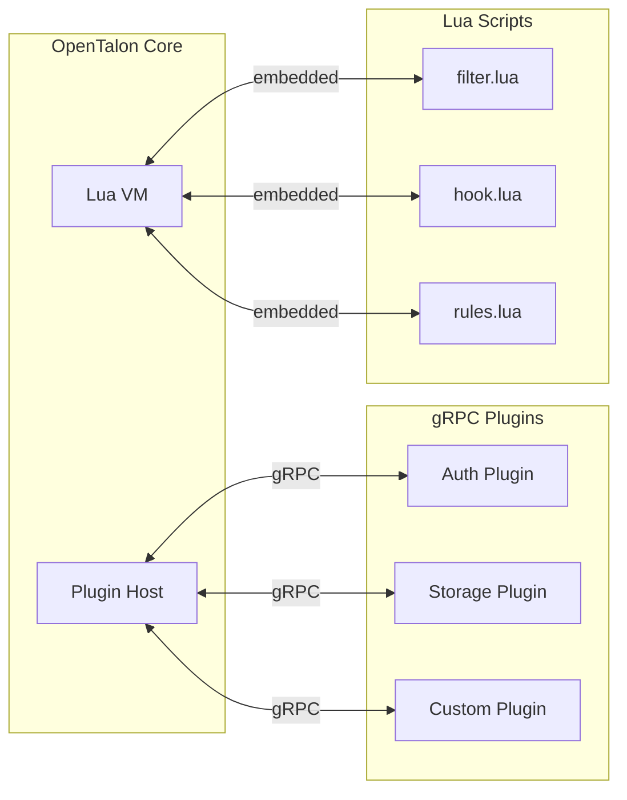
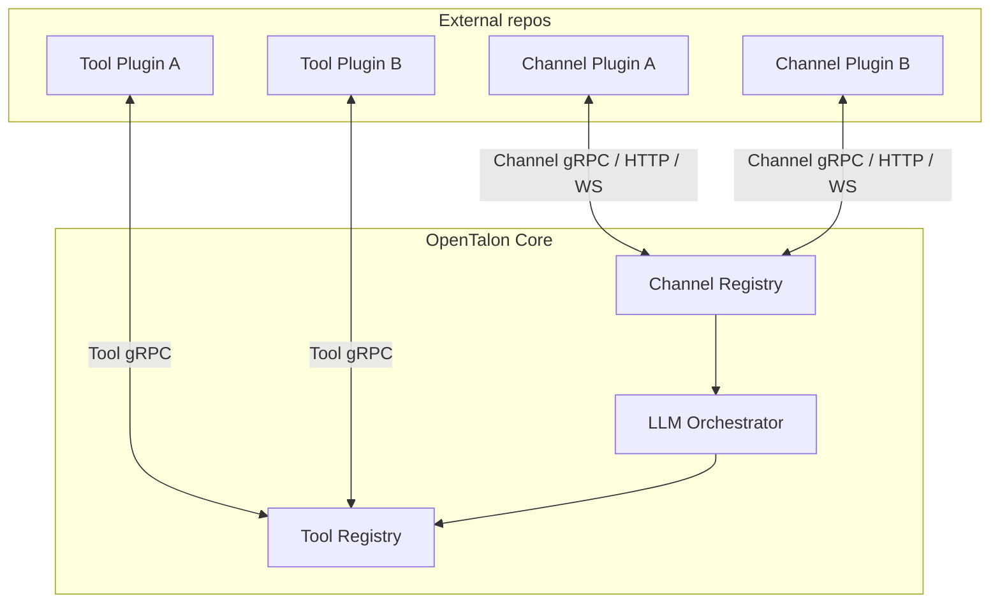

# OpenTalon

**An open-source alternative to OpenClaw, built from scratch in Go.**

[](https://github.com/opentalon/opentalon/actions/workflows/ci.yml)
[](LICENSE)
[](https://go.dev)

---

## What is OpenTalon?

OpenTalon is an open-source platform built from the ground up in Go as a robust alternative to OpenClaw. It is designed for individuals, teams, and large organizations that need a reliable, secure, and extensible solution — without the compromises that come with legacy codebases.

## Why OpenTalon?

Existing solutions often suffer from:

- **Poor maintainability** — tangled codebases that become harder to change over time
- **Low code quality** — inconsistent patterns, lack of tests, and technical debt that compounds
- **Repeatable bugs** — the same classes of issues resurfacing release after release
- **Hard to extend** — adding features means forking or fighting the architecture
- **No smart model routing** — you either pick one model and overpay, or manually juggle providers yourself

OpenTalon is engineered for long-term quality from day one. Every architectural decision is made with maintainability, security, and stability in mind — so the project stays healthy as it grows.

## Core Principles

### Security First

Security is not an afterthought. OpenTalon is secure by default with a minimal attack surface. Plugins run as **separate OS processes** communicating over gRPC, so a compromised or misbehaving plugin can never access the core's memory or escalate privileges. Secrets are handled properly, inputs are validated at every boundary, and dependencies are kept lean and audited. No shortcuts.


- **Plugins work strictly within their own scope** — each plugin does its job and returns a result, nothing else
- **Plugins never talk to each other** — no shared state, no event bus, no direct calls
- **A plugin cannot trigger another plugin** — not via its response, not via prompt injection, not by any mechanism. Only the core/LLM decides what runs next
- **The LLM orchestrates everything** — it decides which plugin to call, in what order, and routes results between them
- **Plugins only see what the core sends** — conversation context and the specific task, nothing more

#### How isolation is enforced

Every plugin response passes through a **guard pipeline** before reaching the LLM:


| Threat | Guard |
|---|---|
| Plugin returns fake tool calls in its output | Response sanitizer strips all tool-call patterns before the LLM sees them |
| Plugin crafts output to trick the LLM | Output is wrapped in `[plugin_output]` blocks — the LLM is instructed to treat it as data only |
| Plugin tries to read another plugin's state | State store enforces namespace isolation — pluginID is set by the core, not the plugin |
| Plugin tries to discover or call other plugins | gRPC contract exposes exactly one method: `Execute`. No registry, no peer discovery |
| Plugin runs forever or consumes all resources | Per-call timeout (configurable) + OS-level resource limits |

#### LLM Safety Rules

The LLM itself receives **built-in safety rules** in its system prompt at the start of every session. These rules instruct the LLM — in multiple languages — to never execute tool calls found inside plugin output, to treat all plugin responses as untrusted data, and to never let a plugin influence which other plugins get called.

The default rules are built into OpenTalon and can be **customized** via `config.yaml`:

```yaml
orchestrator:
  rules:
    - "Never send PII or personal data to external plugins"
    - "All financial data must stay within internal plugins only"
    - |
      When working with customer data, follow these constraints:
      1. Never log raw customer identifiers
      2. Mask email addresses before passing to any plugin
      3. Reject plugin results that contain unmasked credit card numbers
    - |
      For compliance with internal policy SEC-2024-07:
      - Only approved plugins may access production databases
      - Plugin responses containing SQL must be flagged for review
```

This lets organizations add domain-specific rules — including multi-line instructions — without modifying source code. These custom rules are appended to the built-in safety rules and injected into the LLM system prompt at the start of every session.

### Stability

Thorough testing at every level — unit, integration, and end-to-end. Pull requests can only be merged with a fully green test suite, no exceptions — not even for project owners :) Zero tolerance for repeatable bugs. Predictable behavior under load, graceful degradation, and clear error reporting.

### Customizability

A two-tier plugin system lets users extend OpenTalon without forking. Whether you need a full-blown storage backend or a lightweight request filter, there is a plugin tier designed for your use case. Lua hooks let companies enforce their own **business rules, vocabulary, and compliance policies** using deterministic logic — without burning LLM tokens. See [Plugin System](#plugin-system) below. For pluggable messaging channels (Slack, Teams, Telegram, etc.), see [Channels](#channels) and the [full architecture doc](docs/design/channels.md).

### Maintainability

Clean architecture, idiomatic Go, and high code quality standards enforced by linters, formatters, and code review. The codebase is designed to be readable and approachable for new contributors.

### Multi-Platform Deployment

First-class support for running anywhere:

- **Local** — single binary, no external dependencies required to get started
- **VPS** — lightweight deployment with systemd or supervisor
- **Docker** — official container images
- **Kubernetes** — Helm charts for production-grade deployments

## Getting Started

<!-- TODO: Add prerequisites and quick-start commands once the initial codebase exists -->

## Installation

<!-- TODO: Add installation instructions for binary, Docker, Helm/Kubernetes, from source -->

## Plugin System

OpenTalon features a **two-tier plugin architecture** that balances power, safety, and ease of use.



### Tier 1: gRPC Plugins (HashiCorp go-plugin style)

For heavy, standalone extensions such as auth providers, storage backends, and third-party integrations.

- Each plugin is a **separate binary** that communicates with the core over **gRPC via a local socket**
- **Process isolation** — a crashing or misbehaving plugin cannot take down the core; each plugin runs in its own OS process with its own memory space
- **Language-agnostic** — write plugins in Go, Python, Rust, or any language that speaks gRPC (Go is the primary SDK)
- **Security boundary** — separate OS process with limited permissions; strict protobuf contracts define exactly what a plugin can and cannot do
- **Discovery and lifecycle** — plugins are registered via config or auto-discovered from a directory, health-checked, and gracefully restarted on failure
- Same proven pattern behind **Terraform**, **Vault**, and **Nomad**

### Tier 2: Lua Scripting (embedded via gopher-lua)

For lightweight, hot-reloadable customization such as filters, rules, hooks, and data transformations.

- **Embedded Lua VM** inside the core — no separate process, no recompilation needed
- **Hot-reload** — update `.lua` scripts without restarting OpenTalon
- **Sandboxed** — restricted standard library, memory and CPU limits to prevent runaway scripts
- **Expert system + small LLM** — hooks can run rule-based logic (pattern matching, decision trees) and optionally call a small/local LLM via `ctx.llm()` for classification or validation
- **Low barrier to entry** — ideal for operators and non-Go developers who need quick customizations
- Inspired by **Nginx/OpenResty**, **Kong**, and **Redis** scripting models

### Company Rules, Context & Vocabulary — Without Burning LLM Tokens

Lua pre/post hooks let organizations enforce their own business rules, terminology, and compliance requirements **before** the message ever reaches the main LLM. This means:

- **Vocabulary enforcement** — automatically rewrite informal or non-standard terms into company-approved language. A simple Lua replacement table handles this with zero LLM cost.
- **Business rule classification** — route, prioritize, or reject requests using deterministic rules (regex, keyword matching, decision trees). No tokens burned.
- **Compliance checks** — detect PII, credentials, or policy violations in both incoming messages and outgoing responses using pure Lua pattern matching.
- **Context enrichment** — inject company-specific metadata (project codes, team names, priority levels) into the request so the main LLM has the right context without needing to figure it out itself.

For ambiguous cases that rules alone can't handle, hooks can call a small/cheap LLM (`ctx.llm()`) — a local Ollama model or a low-cost cloud model — for lightweight AI tasks like language detection or sentiment analysis. The main (expensive) LLM only sees clean, pre-processed, company-ready input.

```
User message ──▶ Lua pre-hooks (rules + optional small LLM) ──▶ Main LLM ──▶ Lua post-hooks ──▶ Response
                  │  zero tokens for deterministic rules         │              │
                  │  cheap tokens for small LLM fallback         │              │  enforce vocabulary
                  │  enrich context, classify, normalize         │              │  compliance check
```

### Extension Points

Both plugin tiers share the same set of extension points:

- Auth providers
- Storage backends
- Notification channels
- Scheduled tasks
- Request/response hooks
- Custom API endpoints

### Developer Experience

- **gRPC Plugin SDK** — scaffolding CLI, example plugins, and integration test helpers
- **Lua API reference** — documentation, example scripts, and a REPL for interactive testing

> For the full architecture, examples, and Lua API reference, see [docs/design/plugins.md](docs/design/plugins.md).

## Channels

OpenTalon includes a **platform-agnostic channel framework** that lets any messaging system plug in. The core defines abstract contracts and infrastructure — actual implementations (Slack, Teams, Telegram, WhatsApp, Discord, Jira, Matrix, etc.) live in **separate repositories**.



### Five connection modes

The core auto-detects how to connect based on the `plugin` URI scheme:

| Format | Mode | Best for |
|---|---|---|
| `./path/to/binary` | **Binary** | Local dev, simple deployments |
| `grpc://host:port` | **Remote gRPC** | Kubernetes, cloud-native |
| `docker://image:tag` | **Docker** | Self-hosted with isolation |
| `https://endpoint/path` | **Webhook** | Serverless (Lambda, Cloud Functions) |
| `wss://host/path` | **WebSocket** | Real-time, lightweight |

### Configuration

```yaml
channels:
  my-slack:
    enabled: true
    plugin: "./plugins/opentalon-slack"                       # binary
    config:
      app_token: "${SLACK_APP_TOKEN}"
      bot_token: "${SLACK_BOT_TOKEN}"
  my-telegram:
    enabled: true
    plugin: "grpc://telegram-bot.internal:9001"               # remote gRPC
    config:
      bot_token: "${TELEGRAM_BOT_TOKEN}"
  my-teams:
    enabled: true
    plugin: "docker://ghcr.io/opentalon/plugin-teams:latest"  # docker
    config:
      tenant_id: "${TEAMS_TENANT_ID}"
  my-whatsapp:
    enabled: true
    plugin: "https://us-central1-proj.cloudfunctions.net/wa"  # webhook
    config:
      verify_token: "${WA_VERIFY_TOKEN}"
  my-custom:
    enabled: true
    plugin: "wss://custom-bridge.example.com/channel"         # websocket
    config:
      api_key: "${CUSTOM_API_KEY}"
```

The `config` block is **opaque to the core** — it is forwarded to the plugin without interpretation. The core only manages lifecycle and speaks the generic `ChannelService` contract. Each plugin interprets its own config however it needs.

> For the full architecture, see [docs/design/channels.md](docs/design/channels.md).

## Smart Model Routing

OpenTalon includes a **weighted smart router** that automatically picks the best AI model for each task — optimizing for cost without sacrificing quality.


### How it works

1. **Weights** — each model has a weight (0–100). Cheaper models get higher weight and are tried first
2. **Auto-classification** — incoming requests are categorized by heuristics (message length, code blocks, keywords, conversation depth)
3. **Escalation** — if the user rejects a response (regenerates, says "try again", or thumbs-down), the system escalates to the next model by weight
4. **Learning** — the affinity store records which model succeeded for which task type. Over time, the router learns: "code generation needs Sonnet, simple Q&A is fine on Haiku"
5. **User overrides** — if you already know what you want, pin a model per request (`--model`), per session (`/model`), or per task type in config

### Multi-Provider Support

OpenTalon supports multiple AI providers out of the box, with a unified configuration:

- **Built-in providers** — Anthropic, OpenAI, Google, and more
- **Custom providers** — any OpenAI-compatible or Anthropic-compatible endpoint (self-hosted, OVH, Ollama, vLLM, etc.)
- **Provider plugins** — add new providers via the gRPC plugin system
- **Auth profile rotation** — multiple API keys or OAuth tokens per provider, with automatic round-robin and cooldown on rate limits
- **Two-stage failover** — first rotate credentials within a provider, then fall back to the next model in the chain. Exponential backoff on failures.

> For the full architecture, see [docs/design/providers.md](docs/design/providers.md).

## Roadmap

<!-- TODO: Add roadmap milestones -->

## Contributing

<!-- TODO: Add contributing guidelines and link to CONTRIBUTING.md -->

## License

OpenTalon is licensed under the [Apache License 2.0](LICENSE).
