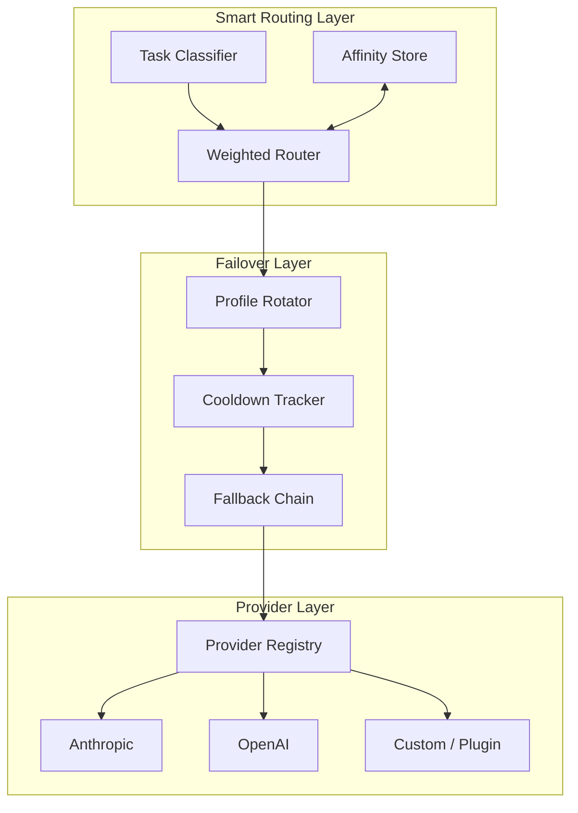
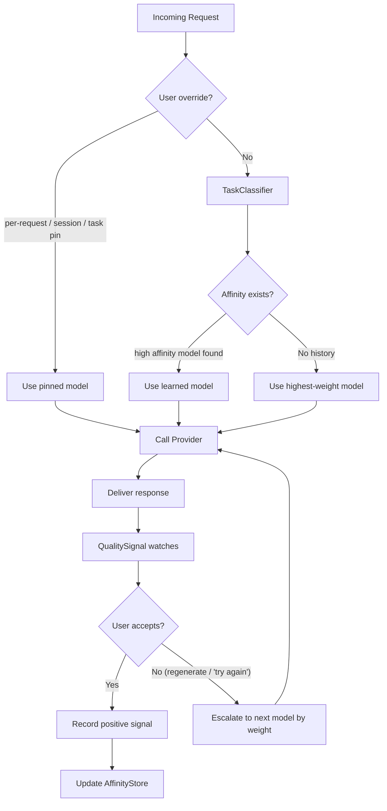
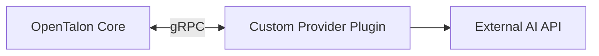

# Provider System Design

This document describes OpenTalon's AI model provider architecture: multi-provider support, weighted smart routing, auth profile rotation, two-stage failover, and extensibility via the plugin system.

## Overview

OpenTalon supports multiple AI providers simultaneously. Each model is referenced using a `provider/model` format (e.g. `anthropic/claude-opus-4-6`). Providers can be built-in, configured as custom endpoints, or loaded as gRPC plugins.

The provider system has three distinct layers:



1. **Smart Routing** — picks the best model for the task based on weights, affinity, and user overrides
2. **Failover** — handles infrastructure failures (rate limits, timeouts, auth errors) with credential rotation and model fallbacks
3. **Provider** — abstracts the actual API calls to each AI provider

## Core Interfaces

```go
// Provider abstracts an AI model provider (Anthropic, OpenAI, custom, etc.).
type Provider interface {
    ID() string
    Complete(ctx context.Context, req *CompletionRequest) (*CompletionResponse, error)
    Stream(ctx context.Context, req *CompletionRequest) (ResponseStream, error)
    Models() []ModelInfo
    SupportsFeature(feature Feature) bool
}

// AuthProfile represents a single credential for a provider.
type AuthProfile interface {
    ProfileID() string
    ProviderID() string
    Type() AuthType // APIKey, OAuth, SetupToken
    Credentials() Credentials
    UsageStats() *UsageStats
}

// ModelResolver resolves a model reference to a concrete provider and auth profile.
type ModelResolver interface {
    Resolve(ctx context.Context, ref ModelRef) (Provider, AuthProfile, error)
}
```

## Auth Profile System

Each provider can have multiple credentials — API keys, OAuth tokens, or setup tokens. The system rotates between them automatically.

### Storage

Credentials are stored in `~/.opentalon/auth-profiles.json`:

```json
{
  "anthropic": [
    { "id": "anthropic:default", "type": "api_key", "key": "sk-ant-..." },
    { "id": "anthropic:work", "type": "api_key", "key": "sk-ant-..." }
  ],
  "openai": [
    { "id": "openai:default", "type": "api_key", "key": "sk-..." }
  ]
}
```

### Selection Order

1. **Session-pinned profile** — if the user pinned a profile via `/model @profileId`
2. **Explicit order** — if `auth.order[provider]` is set in config
3. **Round-robin** — oldest-used first, with cooldown-aware reordering:
   - Profiles in cooldown are pushed to the end
   - OAuth profiles are preferred over API keys
   - Ties broken by `last_used` timestamp (oldest first)

### Session Pinning

One auth profile is pinned per session to keep provider-side caches effective. The pinned profile is reused until:
- It enters cooldown (rate limited or auth failure)
- The session is reset
- The user explicitly switches (`/model @profileId`)

## Weighted Smart Router

This is OpenTalon's key differentiator. Instead of a simple failover chain, the router optimizes for cost by trying cheaper models first and learning from user feedback.

### Key Abstractions

```go
// WeightedRouter selects the best model based on weights, task type, and affinity.
type WeightedRouter interface {
    Route(ctx context.Context, req *CompletionRequest, taskType TaskType) (ModelRef, error)
    RecordSignal(taskType TaskType, model ModelRef, signal Signal)
}

// TaskClassifier auto-detects the type of task from the request.
type TaskClassifier interface {
    Classify(messages []Message) TaskType
}

// QualitySignal captures user feedback on a response.
type QualitySignal interface {
    Detect(previous *CompletionResponse, followUp *Message) Signal
}

// AffinityStore persists (task_type, model) -> success_rate scores.
type AffinityStore interface {
    Get(taskType TaskType) []ModelScore
    Record(taskType TaskType, model ModelRef, signal Signal)
}
```

### Task Classification

The `TaskClassifier` categorizes requests using heuristics:

| Heuristic | Signal |
|---|---|
| Code blocks in message | `code` task type |
| Short conversational message | `chat` task type |
| Long structured prompt | `analysis` task type |
| Keywords ("translate", "summarize") | `transform` task type |
| Conversation depth > N turns | `deep_conversation` task type |

The classifier produces a `TaskType` string used as the affinity key.

### Routing Flow



1. **Check for user override** — per-request (`--model`), per-session (`/model`), or per-task-type pin (`routing.pin` in config). If set, use that model directly.
2. **Classify the task** — `TaskClassifier` analyzes the messages and produces a `TaskType`.
3. **Check affinity** — `AffinityStore` returns models sorted by success rate for this task type. If a model has high affinity, use it.
4. **Fall back to weights** — if no affinity data exists, pick the model with the highest weight (cheapest).
5. **Deliver and watch** — response is delivered to the user. `QualitySignal` monitors for rejection.
6. **On rejection** — escalate to the next model by weight. Record negative signal for the previous model.
7. **On acceptance** — record positive signal. Over time, the router learns user preferences.

### Quality Signals

The system captures two types of feedback:

**Explicit signals:**
- User clicks "regenerate"
- User clicks thumbs-down

**Implicit signals (heuristic detection):**
- User immediately follows up with corrections: "no, try again", "that's wrong", "not what I meant"
- User rephrases the same question right after receiving a response
- Detected via pattern matching on the follow-up message relative to the previous response

### Affinity Decay

Affinity scores decay over time so the system adapts to new models and changing user preferences:
- Configurable decay period (`affinity.decay_days`, default 30)
- Older signals contribute less to the score
- A full reset is available via CLI: `opentalon affinity reset`

### User Model Overrides

When the user already knows what they want:

- **Per-task-type pin** (config) — permanent rule applied before auto-routing:

```yaml
routing:
  pin:
    code: anthropic/claude-sonnet-4
    chat: anthropic/claude-haiku-4
```

- **Per-request pin** (API/CLI) — single call override:

```bash
opentalon complete --model anthropic/claude-opus-4-6 "Explain quantum computing"
```

- **Per-session pin** (chat command) — locks model for the session:

```
/model anthropic/claude-sonnet-4
```

Explicit user choices are recorded as strong positive signals in the AffinityStore. Over time, the router learns user preferences even without permanent pins.

## Two-Stage Failover

Separate from the smart router (which handles quality-based escalation), failover handles infrastructure failures.

### Stage 1: Auth Profile Rotation

On rate limits (429), auth errors, or timeouts:
1. Current profile is put into **cooldown**
2. Next profile for the same provider is selected (round-robin)
3. Request is retried with the new profile

Cooldown uses exponential backoff:
- Initial: 1 minute
- Multiplier: 5x
- Cap: 1 hour
- Billing/credit failures: separate longer cooldown, up to 24 hours

### Stage 2: Model Fallback

If **all** profiles for the current provider are in cooldown:
1. Switch to the next model in `routing.fallbacks`
2. Continue down the fallback chain
3. If all fallbacks exhausted, return error to user

The smart router sits above failover: the router picks the model, failover handles retries when the provider is down.

## Configuration

OpenTalon uses YAML for configuration. The config file lives at `~/.opentalon/config.yaml`.

### Full Example

```yaml
models:
  providers:
    anthropic:
      api_key: "${ANTHROPIC_API_KEY}"
      api: anthropic-messages

    openai:
      api_key: "${OPENAI_API_KEY}"
      api: openai-completions

    ovh:
      base_url: "${OVH_BASE_URL}"
      api_key: "${OVH_API_KEY}"
      api: openai-completions
      models:
        - id: gpt-oss-120b
          name: GPT OSS 120B
          reasoning: true
          input: [text]
          context_window: 131072
          max_tokens: 131072
          cost:
            input: 0.08
            output: 0.44

    ollama:
      base_url: "http://localhost:11434/v1"
      api: openai-completions
      models:
        - id: llama3
          name: Llama 3 8B
          input: [text]
          context_window: 8192
          cost:
            input: 0
            output: 0

  catalog:
    anthropic/claude-haiku-4:
      alias: haiku
      weight: 90          # cheap, try first
    anthropic/claude-sonnet-4:
      alias: sonnet
      weight: 50          # mid-tier
    anthropic/claude-opus-4-6:
      alias: opus
      weight: 10          # expensive, last resort
    openai/gpt-5.2:
      alias: gpt52
      weight: 40
    ovh/gpt-oss-120b:
      alias: ovh
      weight: 80          # cheap custom provider

routing:
  primary: anthropic/claude-haiku-4
  fallbacks:
    - anthropic/claude-sonnet-4
    - openai/gpt-5.2
    - anthropic/claude-opus-4-6

  pin:
    code: anthropic/claude-sonnet-4
    # chat: anthropic/claude-haiku-4

  affinity:
    enabled: true
    store: ~/.opentalon/affinity.json
    decay_days: 30

auth:
  cooldowns:
    initial: 1m
    max: 1h
    multiplier: 5
    billing_max_hours: 24
```

### Key Design Points

- **YAML as primary format** — cleaner than JSON, supports comments, easier to read and edit
- **Environment variable substitution** — secrets use `${VAR}` syntax, never hardcoded
- **Weight field** on each model (0–100) — higher means preferred / tried first
- **`routing.pin`** for explicit per-task-type model assignment
- **Custom providers** just need `base_url` + `api` format + optional `models[]` with cost info
- **Affinity store** is a local JSON file with configurable path and time-based decay

## Plugin Integration

AI providers can be implemented as gRPC plugins using the same `Provider` interface:



- The `Provider` interface is serialized over protobuf
- Plugin providers appear in the registry alongside built-in providers
- Same auth, failover, and routing applies to plugin providers
- Enables community-built provider plugins without changes to the core
