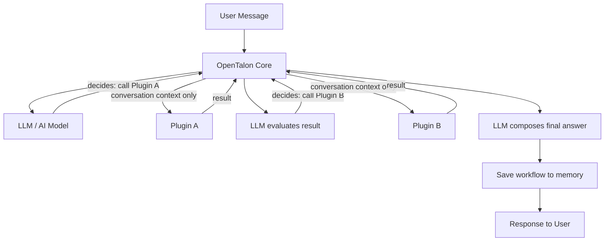
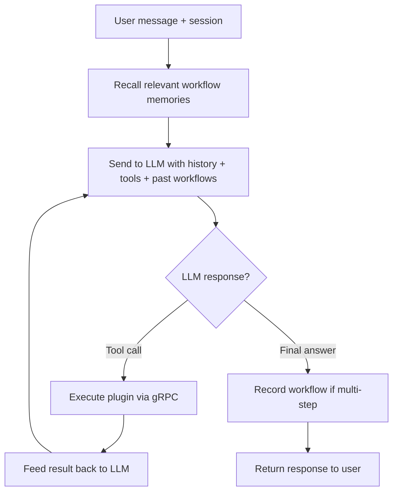
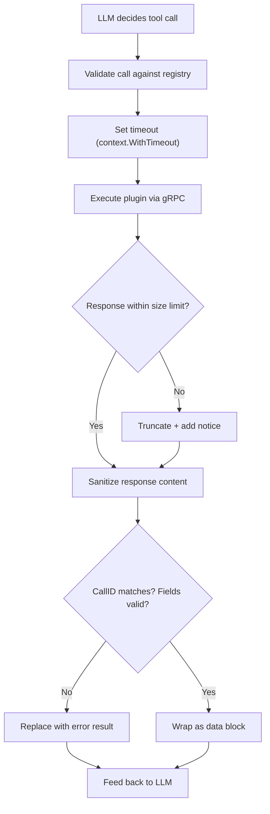

# State Management & LLM Orchestrator

This document describes OpenTalon's state persistence, LLM-driven orchestration, and plugin isolation model.

## Architecture Overview



## Core Rules

1. **The LLM is the orchestrator** -- it decides what to do, which plugin to call, in what order
2. **Plugins are fully isolated** -- they receive conversation context from the core, do their job, return a result
3. **Plugins NEVER talk to each other** -- no direct communication, no shared state, no event bus
4. **Core controls all routing** -- if Plugin A's result needs Plugin B, the core/LLM makes that decision
5. **Plugins only see what the core sends them** -- conversation context and the specific task, nothing more

## LLM Orchestrator (Agent Loop)

The orchestrator implements a tool-calling agent loop:



### Plugin Capabilities

Each plugin declares what it can do when it registers:

```go
type PluginCapability struct {
    Name        string   // e.g. "gitlab"
    Description string   // "Interact with GitLab repositories"
    Actions     []Action // available actions
}

type Action struct {
    Name        string // e.g. "analyze_code"
    Description string // "Analyze code in a repository for issues"
    Parameters  []Parameter
}
```

The LLM sees these as available tools and decides which to call.

### Tool Call Protocol

```go
type ToolCall struct {
    ID       string            // unique call ID
    Plugin   string            // plugin name
    Action   string            // action to perform
    Args     map[string]string // arguments
}

type ToolResult struct {
    CallID  string // matches ToolCall.ID
    Content string // result content
    Error   string // error if any
}
```

## Workflow Memory

Successful multi-step flows are saved so the LLM can recall them on similar future requests.

### How it works

1. User says: "analyze GitLab code and post issue to Jira and create PR"
2. LLM plans the flow, calling plugins one by one
3. On success, the orchestrator saves the workflow pattern:

```yaml
- trigger: "analyze code, create issue, create PR"
  steps:
    - plugin: gitlab
      action: analyze_code
      order: 1
    - plugin: jira
      action: create_issue
      order: 2
    - plugin: gitlab
      action: create_pr
      order: 3
  outcome: success
  timestamp: 2026-02-21T15:00:00Z
```

4. Next time a similar request arrives, the orchestrator retrieves this pattern from memory and includes it as context for the LLM
5. The LLM plans faster because it remembers what worked

### Storage

Workflows are stored in the `MemoryStore` with a `workflow` tag, alongside other long-term memories.

## Configuration

The state directory is configurable via `config.yaml`. If omitted, it defaults to `~/.opentalon`.

```yaml
state:
  data_dir: /var/lib/opentalon   # or ${OPENTALON_DATA_DIR}
```

Environment variable substitution is supported (`${VAR_NAME}`).

### Directory layout

```
<data_dir>/
├── sessions/          # per-session conversation history
│   └── <session_id>.yaml
├── memory/            # long-term facts and workflow patterns
│   └── memories.yaml
└── plugins/           # isolated per-plugin key-value state
    └── <plugin_id>/
        └── state.yaml
```

## State Layers

### 1. Session State

Conversation history per session. Survives restarts.

```go
type Session struct {
    ID          string
    Messages    []provider.Message
    ActiveModel provider.ModelRef
    Metadata    map[string]string
    CreatedAt   time.Time
    UpdatedAt   time.Time
}
```

- Persisted to `<data_dir>/sessions/<session_id>.yaml`
- Compaction: old messages can be summarized to fit context window
- Session lifecycle: create, update, compact, delete

### 2. Long-term Memory

Facts and patterns the system learns over time.

```go
type Memory struct {
    ID        string
    Content   string
    Tags      []string  // e.g. ["workflow", "fact", "preference"]
    CreatedAt time.Time
}
```

- Persisted to `<data_dir>/memory/`
- Searchable by content and tags
- Includes workflow memories (tagged `workflow`)

### 3. Plugin State

Each plugin gets its own isolated key-value namespace.

```go
type PluginStateStore interface {
    Get(pluginID, key string) (string, error)
    Set(pluginID, key, value string) error
    Delete(pluginID, key string) error
    Keys(pluginID string) ([]string, error)
}
```

- Persisted to `<data_dir>/plugins/<plugin_id>/state.yaml`
- Full isolation: Plugin A cannot read Plugin B's state
- Core manages persistence -- plugins use a simple Get/Set API over gRPC

## Plugin Security Guards

Plugins are isolated by design, but isolation must be actively enforced. A plugin must not be able to trigger another plugin, manipulate the orchestrator, or escape its scope — regardless of what it returns.

### Threat Model

| Attack | Description |
|---|---|
| Response injection | Plugin returns text that looks like a tool call, hoping the parser treats it as an instruction |
| Prompt manipulation | Plugin crafts output designed to trick the LLM into calling other plugins |
| State snooping | Plugin tries to read another plugin's state files from disk |
| Registry access | Plugin tries to discover or call other registered plugins |
| Resource abuse | Plugin runs forever, consumes all memory, or floods the network |

### Guards

#### 1. Response Sanitizer

Plugin output is treated as **untrusted data**. Before feeding it back to the LLM:

- Strip or escape any patterns that match tool-call syntax (`[tool_call]`, function-call JSON, etc.)
- Wrap plugin output in a clearly delimited data block so the LLM sees it as a result, never as an instruction
- Enforce a maximum response size (default: 64KB). Truncate with a notice if exceeded.

```go
type Guard struct {
    MaxResponseBytes int
    ForbiddenPatterns []*regexp.Regexp
}

func (g *Guard) Sanitize(result ToolResult) ToolResult
```

#### 2. Execution Timeout

Every plugin call has a deadline. If a plugin does not respond in time, the call is cancelled.

- Default timeout: 30 seconds (configurable per plugin)
- Enforced via `context.WithTimeout` on the gRPC call
- Timed-out calls return an error result — the LLM decides what to do next

#### 3. Result Validation

The core validates every `ToolResult` before accepting it:

- `CallID` must match the original `ToolCall.ID`
- `Content` must be a string within size limits
- `Error` must be a string or empty
- No extra fields, no embedded objects, no binary data

Invalid results are replaced with a generic error.

#### 4. State Namespace Enforcement

The `PluginStateStore` enforces isolation at the API level:

- The `pluginID` is set by the core when it calls the plugin — the plugin cannot override it
- `Get(pluginID, key)` / `Set(pluginID, key, value)` — the plugin only sees its own namespace
- Filesystem paths are derived from `pluginID` — no path traversal possible (plugin IDs are validated to be alphanumeric)

#### 5. Strict gRPC Contract

The plugin gRPC interface exposes exactly one method:

```protobuf
service Plugin {
    rpc Execute(ToolCallRequest) returns (ToolResultResponse);
}
```

There is no method to list plugins, query the registry, access other plugins, or call the orchestrator. The plugin receives a task and returns a result. That is the entire surface.

### Guard Flow


