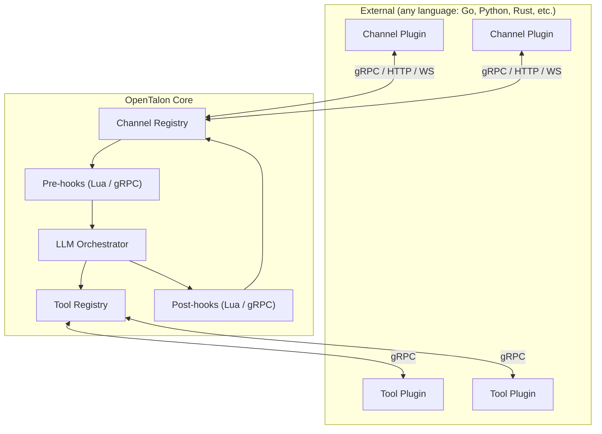

# Extensibility

OpenTalon is fully extensible. **Everything** is language-agnostic — plugins, channels, and hooks can be written in Go, Python, Rust, TypeScript, or any language that speaks gRPC. For lightweight scripting, an embedded Lua VM provides hot-reloadable hooks with zero deployment overhead.



There are **three extension categories**, all language-agnostic:

| Category | Purpose | Interface | Examples |
|---|---|---|---|
| **Tool plugins** | Capabilities the LLM invokes | gRPC (`PluginService`) | GitLab, Jira, code search, CI/CD |
| **Channel plugins** | I/O adapters for messaging platforms | gRPC / HTTP / WebSocket (`ChannelService`) | Slack, Teams, Telegram, WhatsApp, Discord |
| **Hooks** | Pre/post processing pipeline | Lua (embedded) or gRPC | Vocabulary enforcement, compliance, classification |

## Tool plugins (gRPC — any language)

For standalone capabilities the LLM calls: integrations, actions, data retrieval.

- **Language-agnostic** — write in Go, Python, Rust, or any language that speaks gRPC (Go is the primary SDK)
- Each plugin is a **separate binary** communicating over **gRPC via a local socket**
- **Process isolation** — a crashing plugin cannot take down the core
- **Security boundary** — strict protobuf contracts; plugins cannot access other plugins, the registry, or core internals
- **Discovery and lifecycle** — registered via config or auto-discovered from a directory, health-checked, and restarted on failure
- Same proven pattern behind **Terraform**, **Vault**, and **Nomad**
- **`user_only` actions** — set `user_only: true` on any action in `Capabilities()` to hide it from the LLM and allow it only via direct user invocation (e.g. slash commands). The core enforces this: LLM-generated calls to `user_only` actions are rejected. Built-in example: `/install skill` is `user_only` so only the user can install skills, not the LLM.

## Channel plugins (gRPC / HTTP / WS — any language)

I/O adapters for messaging platforms. Written in any language, deployed as separate binaries/services.

- **Platform-agnostic** — the core defines a generic `ChannelService` contract. Implementations for Slack, Teams, Telegram, WhatsApp, Discord, Jira, Matrix, etc. live in separate repositories
- **Five connection modes** — auto-detected from the `plugin` URI scheme:

| Format | Mode | Best for |
|---|---|---|
| `./path/to/binary` | **Binary** | Local dev, simple deployments |
| `grpc://host:port` | **Remote gRPC** | Kubernetes, cloud-native |
| `docker://image:tag` | **Docker** | Self-hosted with isolation |
| `https://endpoint/path` | **Webhook** | Serverless (Lambda, Cloud Functions) |
| `wss://host/path` | **WebSocket** | Real-time, lightweight |

Channel configuration example — all five modes side by side:

```yaml
channels:
  my-slack:
    enabled: true
    plugin: "./plugins/opentalon-slack"                       # binary
    config:
      app_token: "${SLACK_APP_TOKEN}"
      bot_token: "${SLACK_BOT_TOKEN}"
  my-telegram:
    enabled: true
    plugin: "grpc://telegram-bot.internal:9001"               # remote gRPC
    config:
      bot_token: "${TELEGRAM_BOT_TOKEN}"
  my-teams:
    enabled: true
    plugin: "docker://ghcr.io/opentalon/plugin-teams:latest"  # docker
    config:
      tenant_id: "${TEAMS_TENANT_ID}"
  my-whatsapp:
    enabled: true
    plugin: "https://us-central1-proj.cloudfunctions.net/wa"  # webhook
    config:
      verify_token: "${WA_VERIFY_TOKEN}"
  my-custom:
    enabled: true
    plugin: "wss://custom-bridge.example.com/channel"         # websocket
    config:
      api_key: "${CUSTOM_API_KEY}"
```

The `config` block is **opaque to the core** — forwarded to the plugin without interpretation. Each plugin interprets its own config however it needs.

## Hooks: Lua scripting + gRPC

Pre/post processing hooks run **before and after** the main LLM. Two options:

- **Lua scripts** (embedded) — hot-reloadable, sandboxed, zero deployment overhead. Ideal for simple rules, filters, and quick customizations. Can call a small/local LLM via `ctx.llm()` for lightweight AI tasks. See [Lua scripts](lua-scripts.md) for a full hello-world example. Inspired by **Nginx/OpenResty**, **Kong**, and **Redis**.
- **gRPC hook plugins** (any language) — for complex business logic that needs databases, APIs, or custom libraries. Same process isolation and language flexibility as tool plugins.

> For the full architecture, see [docs/design/plugins.md](design/plugins.md) and [docs/design/channels.md](design/channels.md).
