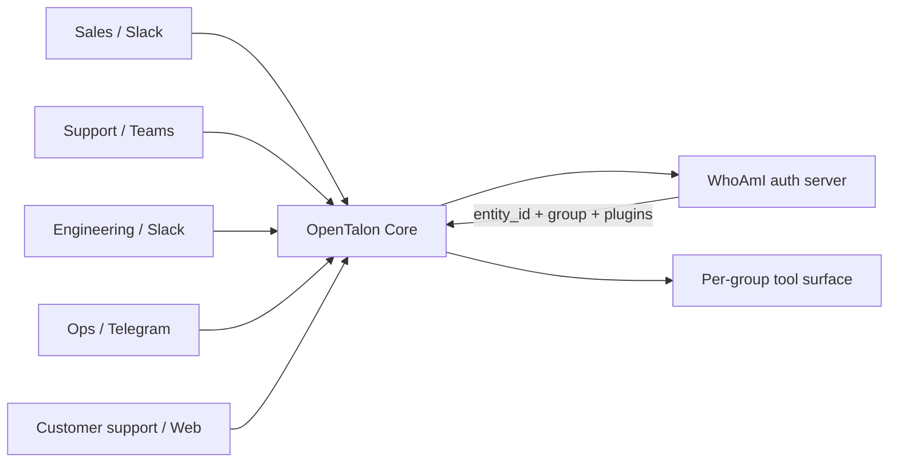

# Profiles & Multi-Tenancy

OpenTalon's profile system turns a single server instance into a secure multi-tenant service. Each client or team gets its own isolated identity — separate conversation history, memories, and plugin access — enforced at the server level with no cooperation needed from channel plugins beyond forwarding a bearer token.

## The enterprise pattern: one orchestrator, many departments, one auth

OpenTalon is designed to be deployed **once per organization**, not once per team. A single OpenTalon instance can serve:

- **Multiple departments** — sales, support, engineering, ops, HR — each with their own conversation history, memory, and policy scope
- **Multiple channels per department** — Slack for engineering, Teams for sales, Telegram for ops, a web widget for customer support — all backed by the same orchestrator core, same model routing, same security guards
- **Same auth & permissions for everyone** — your existing identity provider (the WhoAmI server) is the single source of truth for who is allowed to do what. The Slack user, the Teams user, and the API caller are all resolved to the same `entity_id` and `group`, with the same plugin access rules applied uniformly
- **Same operational surface** — one binary to deploy, one config to manage, one set of metrics to monitor, one upgrade path

For enterprises this means:

- **No "Slack bot vs Teams bot vs internal tool" sprawl** — they are the same brain wearing different uniforms
- **Compliance and audit travel with the user, not the channel** — a finance person blocked from the Jira plugin is blocked everywhere they appear, automatically
- **Department-specific customization without forking** — different `group` values get different tool sets, different `model` choices, different rules; same codebase
- **Onboarding a new department is config, not engineering** — add the department to your auth provider, optionally map a new `group` in WhoAmI, point them at any channel



Everything below describes the mechanism that makes this work.

## How it works

1. The channel plugin attaches a **profile token** to every inbound message (`Metadata["profile_token"]`).
2. OpenTalon calls your **WhoAmI server** to exchange the token for an identity.
3. The WhoAmI server returns an `entity_id`, a `group`, and optionally a list of `plugins` the group is allowed to use.
4. All data for that request is scoped to the `entity_id` — sessions, memories, and plugin state are completely isolated between entities.
5. The `group` controls which tools the LLM can see and use.
6. Usage statistics (token counts, tool calls) are recorded per entity.

If verification fails (bad token, unreachable WhoAmI server, missing `entity_id`), **the request is blocked**. There is no anonymous fallback.

## Minimal configuration

```yaml
profiles:
  who_am_i:
    url: "https://auth.example.com/whoami"
```

That's it. Everything else has sensible defaults (see [WhoAmI server](#whoami-server) below).

## WhoAmI server

OpenTalon calls the WhoAmI URL on every message (with a configurable TTL cache so it only hits the server once per token per minute).

**Default request** — POST with the token in the `Authorization` header:

```
POST https://auth.example.com/whoami
Authorization: Bearer <token>
```

**Expected response** (JSON):

```json
{
  "entity_id": "user-abc123",
  "group": "team-a",
  "plugins": ["jira", "github"],
  "model": "anthropic/claude-3-5-sonnet-20241022"
}
```

| Field | Required | Description |
|---|---|---|
| `entity_id` | Yes | Stable unique identifier. Used to scope sessions, memories, and plugin state. |
| `group` | No | Group name. Used to look up allowed plugins in the `group_plugins` table. |
| `plugins` | No | Plugin IDs allowed for this group. Auto-saved to DB (see [Dynamic plugin assignments](#dynamic-plugin-assignments)). |
| `model` | No | Model override for this profile (e.g. `"anthropic/claude-3-5-sonnet-20241022"`). Overrides the server default for this request. |

### Full WhoAmI config

```yaml
profiles:
  who_am_i:
    url: "https://auth.example.com/whoami"
    method: POST              # GET or POST; default POST
    token_header: Authorization   # header name; default "Authorization"
    token_prefix: "Bearer "       # prepended to token; default "Bearer "
    timeout: 5s                   # per-request timeout; default 5s
    cache_ttl: 60s                # TTL per token in memory; default 60s
    entity_id_field: entity_id    # JSON key for entity ID; default "entity_id"
    group_field: group            # JSON key for group; default "group"
    plugins_field: plugins        # JSON key for plugin list; default "plugins"
    model_field: model            # JSON key for model override; default "model"
    extra_headers: {}             # static headers added to every WhoAmI call (see below)
    metadata_headers: {}          # forward per-message metadata as headers (see below)
```

### Using platform user IDs as the token

For channels like Slack or Teams the platform already provides a stable per-user ID (`U123456` for Slack, `from.id` for Teams). You can use that ID directly as the profile token instead of requiring users to manage separate bearer tokens.

Because platform user IDs are not secret, you should also send a shared server-side secret so your WhoAmI server can verify the request really came from OpenTalon. Use `extra_headers` for this:

```yaml
profiles:
  who_am_i:
    url: "https://auth.example.com/whoami"
    token_header: "X-User-ID"
    token_prefix: ""                            # no prefix — send the raw user ID
    extra_headers:
      X-Security-Token: "${WHOAMI_SECRET}"      # env var expanded at runtime
```

Your WhoAmI server then receives two headers per call:

```
X-User-ID: U123456
X-Security-Token: <secret>
```

It should verify the secret before looking up the user, then return the usual `entity_id` / `group` / `plugins` response.

On the channel side, map the platform user ID into `profile_token` via the `metadata` mapping in `channel.yaml`:

```yaml
# slack-channel/channel.yaml
inbound:
  mapping:
    metadata:
      profile_token: "user"   # Slack user ID → profile_token

# msteams-channel/channel.yaml
inbound:
  mapping:
    metadata:
      profile_token: "from.id"   # Teams user ID → profile_token
```

`extra_headers` values support `${ENV_VAR}` expansion. The headers are added to every WhoAmI call alongside the main token header.

### Distinguishing multiple bots of the same channel type

If you run more than one bot on the same channel (e.g. an admin Slack bot and a customer Slack bot that share an opentalon deployment), the WhoAmI server needs to know which bot a request came from so it can return different groups, plugins, or limits. The token alone is the end-user's platform ID — it's the same regardless of which bot the user is talking to.

Use `metadata_headers` to forward per-bot identity into WhoAmI:

```yaml
profiles:
  who_am_i:
    url: "https://auth.example.com/whoami"
    metadata_headers:
      channel_id: X-Channel-ID    # forward msg.Metadata["channel_id"] as X-Channel-ID
```

Each channel adapter declares what fills `channel_id`. For Slack, the bot's user ID is the natural identifier:

```yaml
# slack-channel/channel.yaml
inbound:
  mapping:
    metadata:
      profile_token: "user"
      channel_id: "{{self.bot_user_id}}"   # template expands from channel state
```

WhoAmI then receives `X-Channel-ID: <bot user id>` on every call and can branch on it. The verifier cache key includes every `metadata_headers` value, so two bots that share a user token never collide on a cached profile.

Metadata mapping values that contain `{{namespace.key}}` are template-expanded against channel state (`self.*`, `config.*`, `env.*`). Plain strings preserve the original behavior of naming an event field to pluck. Configured `metadata_headers` whose target header collides with `token_header`, `channel_type_header`, or any `extra_headers` entry are dropped at startup with a warning.

### Per-message enrichment from the channel

`metadata_headers` can also forward data the channel adapter looks up at
message time via the `inbound.enrich` block in its `channel.yaml`. Example:
the slack-channel calls Slack's `users.info` for every inbound message and
extracts the sender's email and display name; opentalon then forwards them
to WhoAmI as headers:

```yaml
profiles:
  who_am_i:
    metadata_headers:
      channel_id: X-Channel-Id     # which bot
      user_email: X-User-Email     # corp email of the human who sent the message
      user_name:  X-User-Name      # display name (handy for audit logs)
```

Behaviour properties opentalon enforces:
- Enrichment runs **before** WhoAmI: by the time the verifier is consulted,
  `msg.Metadata["user_email"]` is populated (or the message has been
  rejected with `error_code=enrichment_failed`).
- Enrichment is **fail-closed**: any failure (HTTP non-2xx, JSON parse
  error, missing required field) aborts the message with a user-visible
  error frame rather than letting WhoAmI see a half-known identity.
- Cache lookups are **namespaced per channel instance** so an admin bot
  and a customer bot of the same kind never share enriched results even
  when the same Slack user messages both — preserving the multi-tenancy
  invariant. The cache uses Redis when configured (cluster-mode setups),
  in-memory otherwise.

> **TLS in production:** the shared secret prevents forged requests, but without TLS it is visible in transit and replayable. Use `https://` when the WhoAmI server is reachable from outside the cluster. Within a Kubernetes cluster (pod-to-pod over the cluster network), `http://` is acceptable — the network is already isolated and the secret never leaves the cluster.

## Dynamic plugin assignments

Plugin access for a group is stored in the `group_plugins` database table. There are three ways to add assignments, with a clear priority order:

| Source | Priority | Set by |
|---|---|---|
| `admin` | Highest — never overwritten | Admin command (see below) |
| `whoami` | Middle — overwrites `config` | WhoAmI server response |
| `config` | Lowest — only inserted if no row exists | `profiles.groups` in config.yaml |

**WhoAmI auto-save**: when the WhoAmI server returns `"plugins": [...]` in its response, those assignments are automatically upserted to the DB with source `"whoami"`. They persist across restarts — if the WhoAmI server is temporarily unreachable, the last known assignments are used from cache and DB.

**No config needed for groups**: if you don't define `profiles.groups` in config, groups are created dynamically the first time WhoAmI returns them.

### Static baseline (optional)

Use `profiles.groups` as a startup seed. These are inserted with source `"config"` and will not overwrite `"whoami"` or `"admin"` rows:

```yaml
profiles:
  who_am_i:
    url: "https://auth.example.com/whoami"
  groups:
    team-a:
      plugins: [jira, github]   # seeded to DB on startup; WhoAmI can extend or override
    team-b:
      plugins: [gitlab]
```

### Restricting a plugin to certain groups

In `request_packages.inline` (or YAML skill files), add a `groups` field to restrict a plugin to specific groups:

```yaml
request_packages:
  inline:
    - plugin: jira
      groups: [team-a, team-b]   # only these groups can see and use the jira plugin
      packages:
        - action: create_issue
          ...
    - plugin: internal-tools     # no groups field = unrestricted (all profiles can use it)
      packages:
        - action: lookup
          ...
```

Plugins with a non-empty `groups` list are **hidden from the LLM system prompt** for profiles whose group does not have that plugin in the DB. They are also blocked at execution time as a defense-in-depth measure.

## Data isolation

All data is scoped per `entity_id`:

| Data type | How it's isolated |
|---|---|
| Sessions (conversation history) | Session key is prefixed with `entity_id` |
| Memories | `actor_id` column is set to `entity_id` |
| Plugin state (key-value store) | Namespaced by `entity_id` |
| Plugin/tool access | Filtered by `group_plugins` table |

Two entities sharing the same channel can never read each other's sessions or memories.

## Admin commands

Profile assignments can be managed at runtime via built-in admin commands (user-only, not callable by the LLM):

| Command | Args | Description |
|---|---|---|
| `opentalon.profile_assign` | `group`, `plugin` | Assign a plugin to a group (source=`admin`; highest priority, never overwritten by WhoAmI) |
| `opentalon.profile_revoke` | `group`, `plugin` | Remove a plugin from a group |
| `opentalon.profile_list_group` | `group` | List plugins assigned to a group |

Example (via console or any admin-authorized channel):

```
/profile_assign group=team-b plugin=confluence
/profile_revoke group=team-a plugin=jira
/profile_list_group group=team-a
```

Changes take effect immediately on the next request. They survive server restarts (stored in SQLite).

## Usage statistics

When a WhoAmI server is configured and `state.data_dir` is set, every LLM run records usage to the `profile_usage` table in `state.db`:

```sql
SELECT entity_id, group_id, SUM(input_tokens), SUM(output_tokens), SUM(tool_calls), COUNT(*)
FROM profile_usage
WHERE created_at >= date('now', '-7 days')
GROUP BY entity_id
ORDER BY SUM(input_tokens) DESC;
```

Fields: `id`, `entity_id`, `group_id`, `channel_id`, `session_id`, `model_id`, `input_tokens`, `output_tokens`, `tool_calls`, `input_cost`, `output_cost`, `interaction_kind`, `system_source`, `created_at`.

`interaction_kind` is `chat` (a human turn) or `system` (a backend-originated run, e.g. a job-completion note); `system_source` is a per-feature label for system runs (e.g. `job_notify`), NULL for chat. The interactive spend-limit query (see `TotalTokensSince`) counts only `interaction_kind = 'chat'`, so system runs are attributed but never charged against the customer's chat budget.

`input_cost` and `output_cost` are computed from the model's configured price per million tokens (set in `models.providers.<id>.models[].cost`). They will be zero if the model has no cost configured or if no model was recorded.

## Channel plugin integration

Channel plugins send the token via `InboundMessage.Metadata`:

```json
{
  "channel_id": "slack",
  "conversation_id": "C123",
  "sender_id": "U456",
  "content": "hello",
  "metadata": {
    "profile_token": "eyJhbGci..."
  }
}
```

The token can come from anywhere the channel plugin has access to: an HTTP header, a Slack user token, a session cookie, or a pre-shared key stored in the channel's config. OpenTalon does not care where the token originates — it only verifies it against the WhoAmI server.

## Security notes

- **Fail-closed**: requests without a token (when profiles are enabled) are blocked with a generic error message. The entity_id is never guessable from the error.
- **Cache**: the TTL cache is in-process memory (not shared between replicas). In a multi-replica deployment, either use a short `cache_ttl` or configure sticky sessions.
- **Token forwarding**: the original token is available to plugins via context (e.g. for MCP server authentication). It is never logged or stored in the database.
- **Admin commands** are `user_only: true` — the LLM cannot invoke them, even if instructed to by user input.
