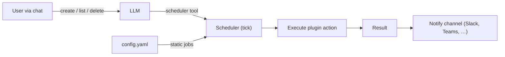

# Scheduler

OpenTalon includes a built-in scheduler for periodic background jobs. Jobs can be defined statically in `config.yaml` or **created dynamically through conversation** — the LLM proposes a schedule, the user confirms, and the job is persisted.



## Example: Monitor GitHub and notify Slack

```yaml
scheduler:
  approvers: ["ops@company.com"]
  max_jobs_per_user: 5
  jobs:
    - name: github-status
      interval: 10m
      action: github.check_status
      args:
        org: "opentalon"
      notify_channel: slack-ops
    - name: deploy-digest
      interval: 24h
      action: github.deployment_summary
      args:
        repo: "opentalon/opentalon"
      notify_channel: slack-engineering
```

Every 10 minutes, the `github` plugin checks the organization's status and posts results to the `slack-ops` channel. A daily deployment digest goes to `slack-engineering`.

## Dynamic jobs via conversation

Users can also create jobs by talking to the LLM:

> **User:** _"Watch the opentalon/opentalon repo for failed CI runs and let me know in #builds"_
>
> **LLM:** _"I'll create a job that checks CI status every 20 minutes and notifies #builds. Should I go ahead?"_
>
> **User:** _"Yes, but check every 15m"_
>
> **LLM:** _"Done — created job `ci-watch-opentalon` running every 15m, notifying #builds."_

## Governance

- **Config-defined jobs are immutable** — users cannot modify or remove them through conversation
- **Approvers** — when configured, only designated users can create, update, or delete dynamic jobs
- **Per-user limits** — `max_jobs_per_user` prevents any single user from creating excessive jobs
- **Full CRUD** — list, pause, resume, update, and delete jobs through the LLM or directly via the scheduler API
